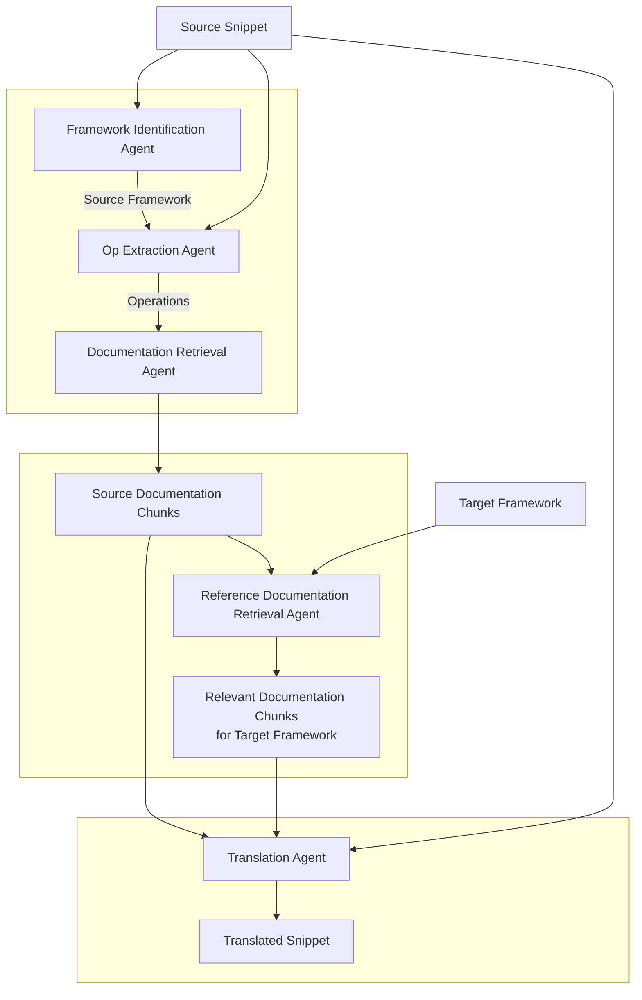

# ML Framework Bot

An agentic workflow to translate machine learning codebases across ML frameworks reliably at scale.

## Installation

```bash
pip install -U pip
pip install -U uv
uv sync
```

## Usage

For example usage refer to [`examples/`](./examples/)

## Workflow


